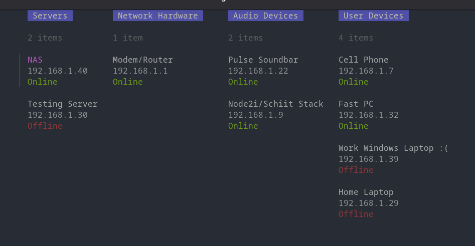

# lablog
### The simple little homelab notebook

Find yourself forgetting usefull information about your home network devices? Need another CRUD app in your life? Store info here for easy access fom inside your terminal. See device online status at a glance.
#### Requirements
 - sqlite3
### Installation
 - Clone this repository and "go install ." in the root of the repo. lablog will be with you forever.
### TODO
 - Refine formatting (especially the forms)
 - Style the detail view
 - Add port register functionality to keep track of useful ports/APIs
